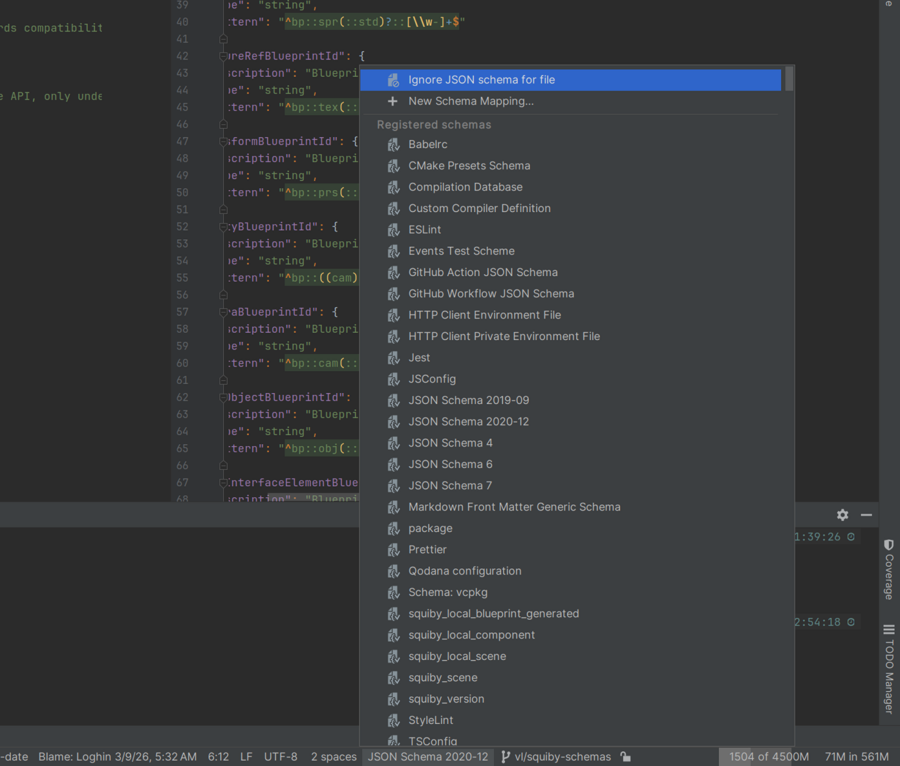
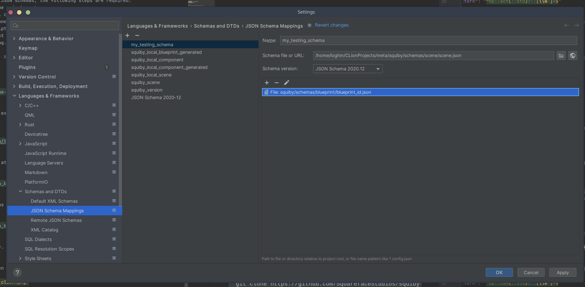
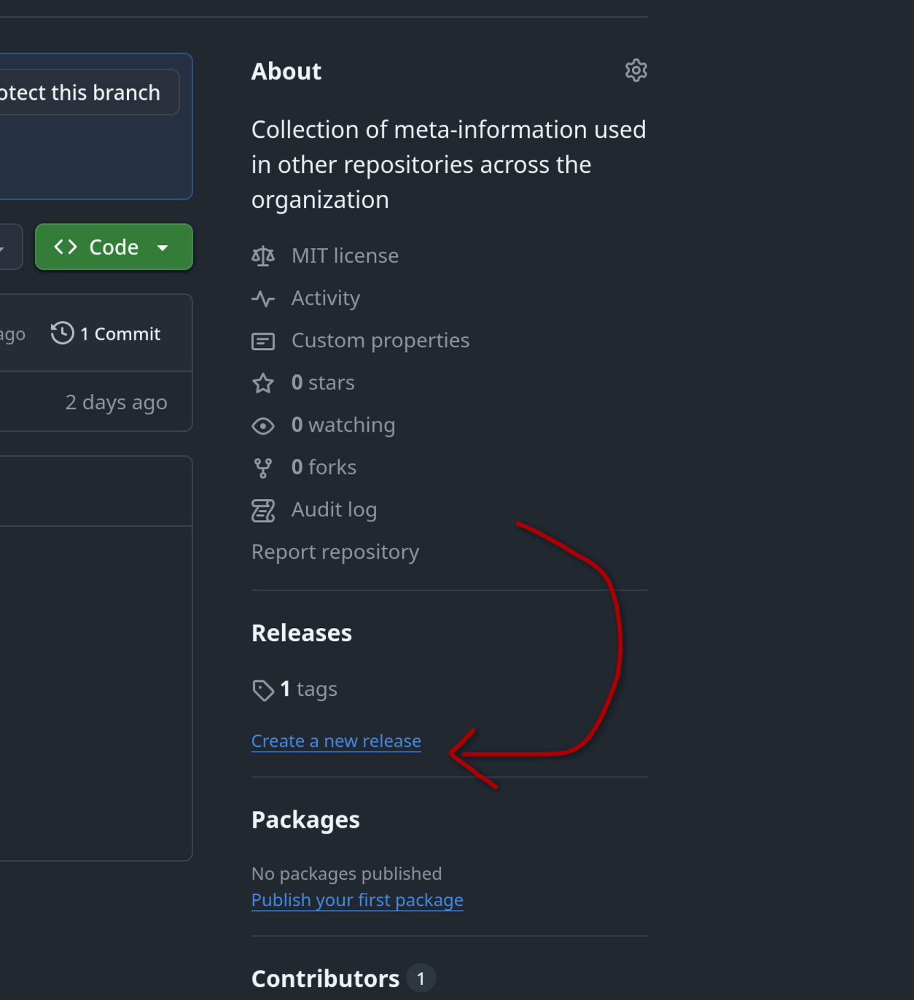
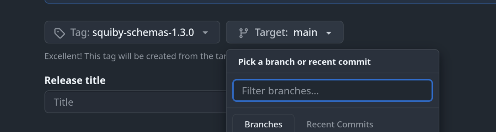

# Squiby JSON schemas

Contains a set of JSON schemas used across the squiby engine project.

## Usage

To use JSON schemas, either import it in the '$schema' root tag, or add them to the IDE:

Bottom right corner, with a .json file open



And add the URL of the schema (view file as raw to get URL).



## Update guidelines

### Normal Changes

To update the JSON schemas, the following steps are required:
1. Prepare a working branch.
2. Make your changes in the schema files (files in "squiby/schemas", excluding the ones from "bundled", as these are the merged generated ones).
3. Run the bundler script from [here](https://github.com/SquarefaceStudios/squiby-tooling/blob/main/scripts/json_schema_bundler.py).
4. Commit the changes to your working branch, including the generated bundled files.
5. Optionally, test your bundled schemas, either by manual import into validator (IDE), or by fetching it from raw contents from GitHub.
6. Make a PR on the meta repository.

[//]: # (Remember to update the link from step 3. after merge into main.)

### Releases

To prepare a release of the JSON schemas, the following steps are required:
1. Have a commit ready on the main branch
2. From this commit, we will create a release branch. This should be named: "squiby/schemas/version". Example: "squiby/schemas/1.2.4"
3. On this commit branch alone, prepare a commit that changes all the '$' meta fields that use "https" links to the CDN repository "raw.githubusercontent.com" to refer to your release branch.
4. Do the usual (re-run script for bundling)
5. Push your changes and test that the CDN repository provides the content from the release branch as is.
6. Finally, add a release tag.

### Step by step breakdown - Normal Changes

1. Prepare a working branch

```shell
git checkout your-branch-name-here
```

2. Make your changes - self-explanatory.
3. Run the bundler script

```shell
git clone https://github.com/SquarefaceStudios/squiby-tooling
```

Bundler script can be found at "scripts/json_schema_bundler.py". Run it as:

```shell
python3 /path/to/json_schema_bundler.py json_schema_to_update json_schema_to_update ... -i /path/to/meta/squiby/schemas -o /path/to/meta/squiby/schemas/bundled
```

Example, with current schemas being "scene.json" and "blueprint.json"

```shell
python3 /path/to/json_schema_bunder.py scene.json blueprint.json -i /path/to/meta/squiby/schemas -o /path/to/meta/squiby/schemas/bundled
```

4. Commit - self-explanatory. Also push your changes.
5. Test you bundled schemas:

Locally in CLion: create/open a .json file to validate, and select the schema as such:


When a JSON  file is opened, this context action appears on the lower right area (as in the screenshot).

Select "New Schema Mapping...".


Add your local bundled output, and remember to have the test file mapped correctly.

Then you can test the schema validation in the test JSON file.

6. Make a PR - self-explanatory.

### Step by step breakdown - Releases

1. Have a commit ready on the main branch - Steps above.
2. From this commit, we will create a release branch. This should be named: "squiby/schemas/version". Example: "squiby/schemas/1.2.4"

```shell
git checkout -b squiby/schemas/version
```

For example, releasing 1.3.0

```shell
git checkout -b squiby/schemas/1.3.0
```

3. On this commit branch alone, prepare a commit that changes all the '$' meta fields that use "https" links to the CDN repository "raw.githubusercontent.com" to refer to your release branch.

Look in the schema files for all occurrences of "https" links to the main branch CDN. These are prefixed by:

```
https://raw.githubusercontent.com/SquarefaceStudios/meta/refs/heads/main
```

Change these to the CDN that will be used on the release branch. Replace `main` with `squiby/schemas/version`

Example for release 1.3.0

```
- https://raw.githubusercontent.com/SquarefaceStudios/meta/refs/heads/main
+ https://raw.githubusercontent.com/SquarefaceStudios/meta/refs/heads/squiby/schemas/version
```

Example for release 1.3.0, for references to blueprint

```
- https://raw.githubusercontent.com/SquarefaceStudios/meta/refs/heads/main/squiby/schemas/blueprint/blueprint.json
+ https://raw.githubusercontent.com/SquarefaceStudios/meta/refs/heads/squiby/schemas/version/squiby/schemas/blueprint/blueprint.json
```

4. Do the usual (re-run script for bundling) - self-explanatory.
5. Push your changes and test that the CDN repository provides the content from the release branch as is.

Before adding the release tag and freezing the branch, make sure that the links in the CDN work as expected

Import a schema in a validator (you can use the steps in step 5. in the previous chapter, to import it to clion.).
Instead of importing it locally, import it from the GitHub raw user content CDN

```
https://raw.githubusercontent.com/SquarefaceStudios/meta/refs/heads/squiby/schemas/version/squiby/schemas/blueprint/blueprint.json
```

OR: Use the CDN link in a test .json file in the `$schema` field

```json
{
  "$schema": "https://raw.githubusercontent.com/SquarefaceStudios/meta/refs/heads/squiby/schemas/version/squiby/schemas/blueprint/blueprint.json"
}
```

6. Finally, add a release tag.

Once everything works as expected, create a release on the release branch you created on the meta repository.



Use `squiby-schemas-version` as the tag name.

Select your release branch from target.

Title should be the same as the release tag (`squiby-schemas-version`).



Mark the previous release as the current one, by the following rules. Starting from version 2.4.1 as an example:
- If your release changes the major version (3.0.0), then your previous version is the previous patch version at THIS time version (2.4.1)
- If your release changes the minor version (2.5.0), then your previous version is the previous patch version at THIS time starting, but having the same MAJOR version:
  - If we release 2.5.0 now, but latest release is 3.1.4, then previous version of 2.5.0 will be 2.4.x.
- If your release changes the patch version (2.4.2), then your previous version is the selected version, regardless of latest release.
  - If we release 2.4.2 now, but latest major release is 3.1.4, and latest minor release is 2.6.3, the previous version will still be 2.4.1.

Feel free to generate the notes, but you should manually edit or document changes from the latest to the current.
